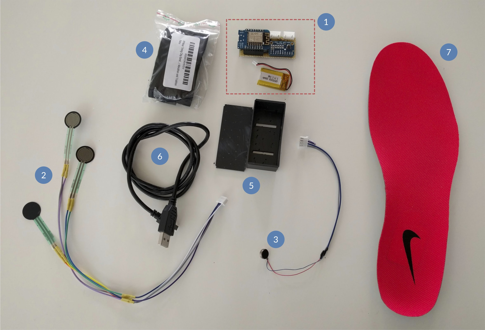

## ESP8266

This is second iteration of the platform using WiFi and an ESP8266.

## Hardware Requirements
- Bread- or Perfboard
- Wemos D1 Mini
- up to 4 force sensitive resistors (https://www.adafruit.com/products/166)
- 4x 10kohm Resistor
- 4.5V LiPo Battery
- Analog to Digital Converter https://www.adafruit.com/product/1083 - https://de.aliexpress.com/item/1005005926434391.html- 
- 3V Disk Vibration Motor  - any brand will do
- Optocopler to drive it TLP621
- 220ohm Resistor for Optocopler
- For wiring, please check `./Schematics/`

## Software - Microcontroller
There is a complete example for a forefoot running assistant in ./Tutorial/Arduino/complete
The Arduino will open up a WiFi Accesspoint with a Webscoket streaming the sensor data.

## Software - PC
There is a small demo website ./Tutorial/Web with which this data can be visualized. 

