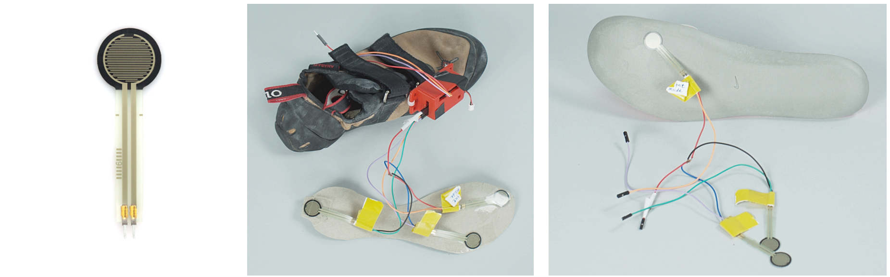

# Using off-the-shelf sensors for flexible shoe sensing

This repository holds two applications of cheap FSR sensors for rapid prototyping of smart insoles for various feedback systems.

## RFDuino
This is the first iteration of the platform which supports the (now discontinued) RFDuino. 
[Read more](./RFDuino/)

## ESP8266
This implementation supports the ESP8266, works over WiFi and also includes one output channel for a vibration motor.
[Read more](./ESP8266//)

## Cardboard Insoles
In `./scaled_insole_pdf` you can find a set of scaled (in mm) A4 PDFs of printable insoles which can serve as medium to apply the pressure sensors and stick them into the shoes of your choosing. 